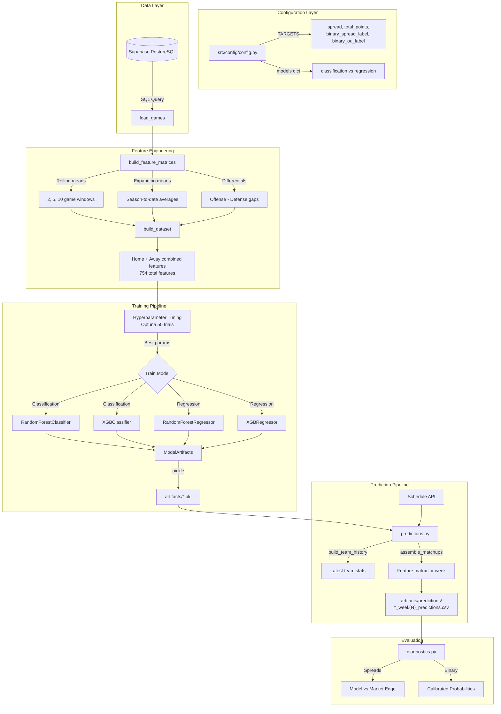

# NFL Prediction Model

A machine learning system for predicting NFL game outcomes including spreads, totals, and binary classifications.

## Architecture Overview



## Project Structure

```
NFL_MODEL/
├── src/
│   ├── config/
│   │   └── config.py           # Targets, model types, feature configs
│   │
│   ├── models/
│   │   ├── nfl_model.py        # NFLModelV2 - core model class
│   │   └── hyper_parameter_tuning.py  # Optuna-based HP search
│   │
│   ├── features/
│   │   ├── team_level_features/
│   │   ├── player_level_features/
│   │   ├── advancedmetric_level_features/
│   │   └── gamecontext_level_features/
│   │
│   ├── scripts/
│   │   ├── train.py            # Quick baseline training (no HP tuning)
│   │   ├── train_rf.py         # Random Forest with Optuna tuning
│   │   ├── train_xgb.py        # XGBoost with Optuna tuning
│   │   ├── predictions.py      # Generate predictions for upcoming week
│   │   ├── diagnostics.py      # Analyze prediction results
│   │   ├── run_historical_week.py  # Backtest on past weeks
│   │   └── tune_hyperparameters.py # Standalone HP search
│   │
│   ├── evaluation/
│   │   ├── evaluation.py
│   │   └── model_analysis.py
│   │
│   └── utils/
│       ├── db_utils.py         # Supabase/PostgreSQL connection
│       ├── schedule_utility.py # Get current week schedule
│       └── ...
│
├── artifacts/
│   ├── *.pkl                   # Trained model artifacts
│   └── predictions/            # CSV prediction outputs
│
├── notebooks/                  # Exploratory analysis
└── tests/                      # Unit tests
```

## Targets

| Target | Type | Description |
|--------|------|-------------|
| `spread` | Regression | Predicted home margin (home_score - away_score) |
| `total_points` | Regression | Predicted combined score |
| `binary_spread_label` | Classification | 1 = favorite covers, 0 = underdog covers |
| `binary_ou_label` | Classification | 1 = over, 0 = under |

## Quick Start

### 1. Setup Environment
```bash
pip install -r Readme/requirements.txt
```

### 2. Configure Database
Create `.env` file with Supabase credentials:
```
SUPABASE_URL=your_url
SUPABASE_KEY=your_key
DATABASE_URL=postgresql://...
```

### 3. Train Models

**Quick baseline (no hyperparameter tuning):**
```bash
python -m src.scripts.train
```

**Production Random Forest (with Optuna tuning):**
```bash
python -m src.scripts.train_rf
```

**Production XGBoost (with Optuna tuning):**
```bash
python -m src.scripts.train_xgb
```

### 4. Generate Predictions

Edit `src/scripts/predictions.py` to set the target week:
```python
season = 2025
week = 1
```

Run predictions:
```bash
python -m src.scripts.predictions
```

Output: `artifacts/predictions/all_targets_week{N}_predictions.csv`

### 5. Analyze Results
```bash
python -m src.scripts.diagnostics
```

## Data Flow

```
1. load_games()
   └── SQL query → raw game data + team stats

2. build_feature_matrices()
   ├── Parse composite columns (cmp_att_yd_td_int → completions, attempts, yards, etc.)
   ├── Compute efficiency stats (completion%, rushing%, 3rd down%, etc.)
   ├── Rolling averages (2, 5, 10 game windows)
   ├── Expanding (season-to-date) averages
   ├── Offensive vs Defensive differentials
   └── Strength of schedule ratios

3. build_dataset()
   └── Combine home team + opponent features → 754 total features

4. Training
   ├── Time-series CV (no future leakage)
   ├── Optuna hyperparameter optimization
   └── Save ModelArtifacts (model + feature_columns + metrics)

5. Prediction
   ├── Load latest artifact for each target
   ├── Build feature matrix for upcoming games
   └── Generate predictions + probabilities
```

## Model Artifacts

Each trained model is saved as a `ModelArtifacts` dataclass:

```python
@dataclass
class ModelArtifacts:
    model: object           # Trained sklearn/xgboost model
    feature_columns: List   # Ordered list of 754 feature names
    target: str             # "spread", "binary_spread_label", etc.
    metrics: Dict           # accuracy/f1 or mae/r2
    model_type: str         # "RandomForestClassifier", etc.
    params: Dict            # Hyperparameters used
    feature_hash: str       # Hash for reproducibility
```

## Key Files

| File | Purpose |
|------|---------|
| `src/config/config.py` | All configuration (targets, model types, feature specs) |
| `src/models/nfl_model.py` | `NFLModelV2` class - load data, build features, train |
| `src/models/hyper_parameter_tuning.py` | Optuna-based hyperparameter search |
| `src/scripts/train_rf.py` | Train all targets with Random Forest |
| `src/scripts/train_xgb.py` | Train all targets with XGBoost |
| `src/scripts/predictions.py` | Generate predictions for a specific week |

## Example Workflow

```bash
# 1. Train all 4 targets with XGBoost
python -m src.scripts.train_xgb

# 2. Train all 4 targets with Random Forest
python -m src.scripts.train_rf

# 3. Generate Week 1 predictions (edit predictions.py first)
python -m src.scripts.predictions

# 4. View results
cat artifacts/predictions/all_targets_week1_predictions.csv
```

## Output Format

Predictions CSV columns:
- `season`, `week`, `hometeamid`, `awayteamid`
- `market_line_home`, `market_home_margin`, `market_total`
- `target` - which model made this prediction
- `model` - "rf" or "xgb"
- `prediction` - predicted value or class
- `prob_0`, `prob_1` - class probabilities (classification only)
